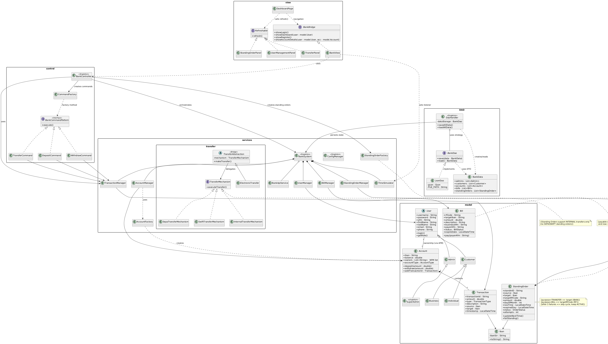
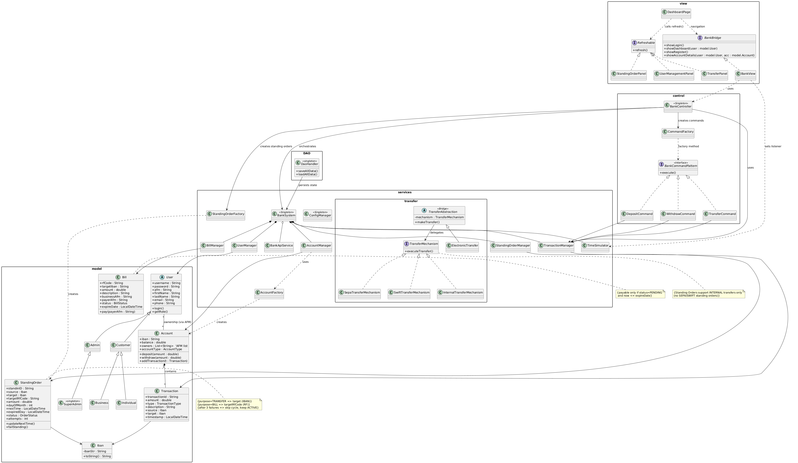

content = """#  eBankingApp - Σύστημα Ηλεκτρονικής Τραπεζικής


Μια ολοκληρωμένη **Desktop εφαρμογή ηλεκτρονικής τραπεζικής (e-banking)**, γραμμένη σε **Java**. Αναπτύχθηκε στα πλαίσια πανεπιστημιακής εργασίας  και εστιάζει στην εφαρμογή αρχών Αντικειμενοστρεφούς Προγραμματισμού (OOP) και γνωστών Design Patterns.

##  Βασικά Χαρακτηριστικά

- ** Σύστημα Ταυτοποίησης & Ρόλοι:** - Υποστήριξη εγγραφής και σύνδεσης (Login/Register).
  - Διαφορετικοί ρόλοι: **Πελάτες** (Ιδιώτες / Επιχειρήσεις), **Admins** και **SuperAdmins**.
- ** Πλήρης Διαχείριση Λογαριασμών:** Δημιουργία και προβολή στοιχείων (ΙΒΑΝ, Υπόλοιπο) για τρεχούμενους λογαριασμούς και λογαριασμούς ταμιευτηρίου.
- ** Τραπεζικές Συναλλαγές:**
  - Κατάθεση (Deposit)
  - Ανάληψη (Withdraw)
  - Μεταφορές χρημάτων (Transfer) με υποστήριξη για: **Εσωτερικές Μεταφορές**, **SEPA**, και **SWIFT**.
- ** Πάγιες Εντολές & Πληρωμές:** Αυτοματοποιημένη εκτέλεση πληρωμών και μεταφορών με χρήση προσομοιωτή χρόνου (`TimeSimulator`).
- ** Γραφικό Περιβάλλον (GUI):** Φιλικό προς τον χρήστη περιβάλλον, χτισμένο με **Java Swing** (Dashboards, Πίνακες Ιστορικού, Κάρτες Συναλλαγών).
- ** Αποθήκευση Δεδομένων:** Τοπική αποθήκευση σε μορφή JSON (`Database.json`) με τη χρήση της βιβλιοθήκης **Gson**.

---

##  Αρχιτεκτονική & Design Patterns

Το project ακολουθεί αυστηρά αρχιτεκτονικά πρότυπα για να διασφαλίσει την επεκτασιμότητα και τη συντηρησιμότητα του κώδικα.

### 1. Model-View-Controller (MVC)
Η εφαρμογή χωρίζεται σε ξεκάθαρα επίπεδα:
- **Model:** Οι οντότητες (User, Account, Transaction κ.λπ.).
- **View:** Τα GUI components (Panels, Frames).
- **Control / Services:** Η επιχειρησιακή λογική, η επεξεργασία εντολών και οι κεντρικές υπηρεσίες.

### 2. Design Patterns Που Χρησιμοποιήθηκαν
* **Command Pattern:** Χρησιμοποιείται στο πακέτο `/control` (`DepositCommand`, `TransferCommand`, `WithDrawCommand`) για την ομοιογενή και ασφαλή εκτέλεση (ή ακύρωση) των συναλλαγών.
* **Data Access Object (DAO) Pattern:** Διαχωρίζει την επιχειρησιακή λογική από την πρόσβαση στη βάση δεδομένων (JSON). 
  
  
  
* **Factory Pattern:** Για την ευέλικτη δημιουργία αντικειμένων (π.χ. `AccountFactory`, `CommandFactory`, `StandingOrderFactory`).
* **Strategy Pattern:** Στους μηχανισμούς μεταφοράς χρημάτων (πακέτο `services/transfer` - `Internal`, `Sepa`, `Swift`).

### 3. Διάγραμμα Κλάσεων (Class Diagram)
Συνολική επισκόπηση της δομής του συστήματος (UML):



---

##  Δομή του Project

Έξοδος κώδικα
README.md created successfully.

```text
UML_Project/
│
├── eBankingApp.java       # Η κύρια κλάση εκκίνησης (Main) της εφαρμογής
├── DAO/                   # Κλάσεις διαχείρισης δεδομένων (BankDao, JsonDao) & gson.jar
├── control/               # Controllers και Command Pattern classes
├── model/                 # Οι οντότητες δεδομένων (User, Account, Admin, Iban, etc.)
├── services/              # Business Logic (Managers, Transfer mechanisms, TimeSimulator)
├── view/                  # Το Γραφικό Περιβάλλον (UI / Java Swing components)
├── classDiagram.png       # Το UML διάγραμμα του συστήματος
└── DAO.png                # Το διάγραμμα για το DAO Pattern
